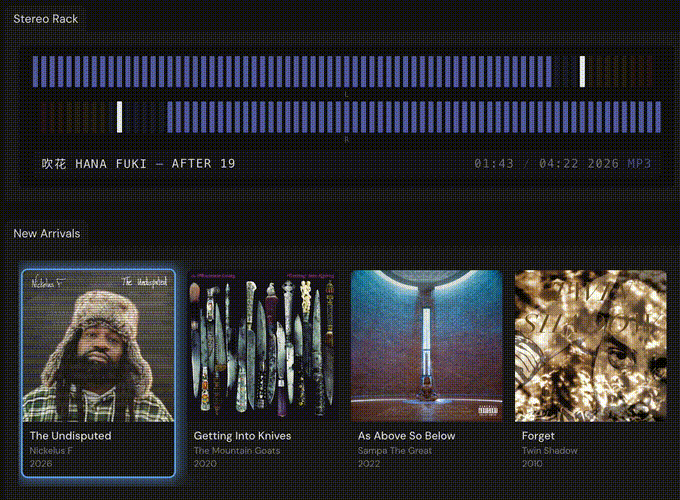

# welcome to kamp

your music, beautiful

your artists, loved

your kamp, free

---

## features

**love your library** - kamp celebrates the experience of listening with prominent album art, a configurable home page, and fast search. kamp will watch a folder for new files and tag them using musicbrainz. if you don't like what you see, it's easy to edit album and track info. 

**support your artists** - kamp integrates with bandcamp to help you get access to the music you support. just sign in to bandcamp and choose how often you want kamp to check, or press the sync button whenever you want to grab your latest acquisitions.

**free as in freedom** - kamp will never cost anything and will never spy on you. your data stays local, we will never serve you ads, and never collect analytics. it's your library, not ours.

---

## installation

the latest release is always live at [kamp.fm](https://kamp.fm).

---

## development

wanna contribute? [developer docs are right here](./docs/development.md).